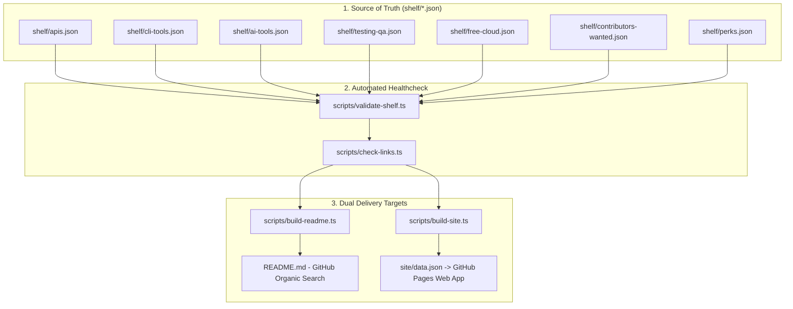

# ?? Welcome to the DevShelf Wiki

**DevShelf** is an open-source, crowdsourced directory of high-utility developer tools, free APIs, AI agents, CLI productivity utilities, testing frameworks, and startup perks.

Unlike static markdown "Awesome" lists that slowly decay into dead links and abandoned URLs over time, DevShelf is built as an **automated, programmatic database** with:
- Structured JSON schemas in `shelf/*.json`.
- Automated weekly HTTP link validation ([`scripts/check-links.ts`](Automated-Validation-Pipeline)).
- An instantaneous, zero-latency [interactive Web Directory](https://ritualdev-lab.github.io/DevShelf/) with category filtering and fuzzy search.
- Zero-paywall guarantee (only 100% open-source or genuine perpetual free tiers).

---

## ??? Wiki Navigation

1. **[?? Curated Categories & Schemas](Curated-Categories)**
   Detailed breakdown of the 7 shelf categories, inclusion criteria, and metadata properties.
2. **[?? Automated Validation & Healthcheck Pipeline](Automated-Validation-Pipeline)**
   Technical explanation of how dead links are detected, concurrent pings, bot-defense handling, and GitHub Actions cron jobs.
3. **[?? Contributor Guide & Development Workflow](Contributor-Guide-&-Workflows)**
   Step-by-step instructions for submitting a new tool, testing endpoints locally, and passing CI validation.
4. **[?? Ecosystem Synergy](Ecosystem-Synergy)**
   How DevShelf interconnects with FlashLane, GitWhisper, AutoHeal-QA, and LocalRAG-Kit.

---

## ??? System Architecture

DevShelf maintains a single source of truth for all curated developer resources:

---

## ??? The 3 Core Guarantees of DevShelf

1. **0% Hidden Paywalls**: No "14-day free trials" that require credit cards. Every resource must offer an authentic perpetual free tier or be 100% Free and Open Source Software (FOSS).
2. **100% Endpoint Health**: If a project domain expires, gets acquired, or 404s, our automated weekly healthcheck catches it and alerts maintainers to update or delist it.
3. **Developer First**: Concise, objective descriptions without marketing buzzwords, affiliate links, or tracking parameters.
